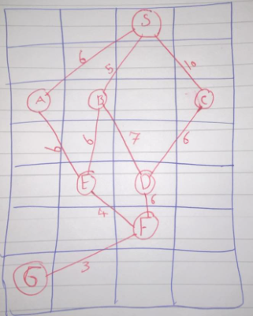

# 1. Forming Project Teams
Imagine a tech company that has a pool of software developers, and the manager needs to form a project team for a new initiative. There are (n) developers available, but the project requires exactly (k) developers.

the app should be GUI where user enters the number of all developers that the company have in a input-number, and also another input-number to enter amount of developers per team, then click on a button to start the calculation

on the same gui bellow the app should say how many sub-teams can be created
and another windows will open that shows the a table of ( Binomial Coefficient ) which is how we got the answer and the solution number should be in another color than the others 

## example:
The manager wants to know how many different teams can be formed using 4 developers out of the available 10.
answer: 210 different teams

## Requirements:
- For the main Logic no libraries is allowed
- For the GUI feel free to use any thing you want
- 2 number-inputs for total number of developers and the size of a sub-team
- a submit button
- bellow the form a place that answer is shown 
- bellow the form say error or some thing nice when the numbers are invalid
- open another window to show the Binomial Coefficient table (board)
- the solution number should be in different color comparing the other colors

# 2. Auto Completion/Correction
Create a app where user enters a text and the app will help the user by auto completion/correction of the word,

user enters a text and the top 5 suggested words will be listed on right side of the app if user clicks on any of them the word in the input will be replaced by the suggestion

after clicking the word a table/board will open showing why this word is suggested (how much similar)

## example:
user enters word "aplpe" and the app will give suggestion as "apple"
after selecting the word "apple" set the input text to apple then a windows will be opened showing Longest Common Subsequence (LCS) calculation

## Requirements:
- For the main Logic no libraries is allowed
- use Longest Common Subsequence (LCS) in Dynamic programming
- use a world list provided by the supervisor
- For the GUI feel free to use any thing you want
- 1 input for user two write his/her text
- a list of top 5 suggestion words
- suggestions should re-generate when input value changes
- clicking on a suggested word should be placed in the input 
- after confirming a word then open a new windows showing Longest Common Subsequence (LCS) table
- the table should have the arrows and should be correct 
- the last arrow that we find LCS by it should be in different color
- some place in the new window type the similarity (example: 5 characters similar) 

## Note:
feel free to implement the top 5 suggestions selection in any way you want for example making user selects it by the arrow button just like chrome auto completion

# 3. Ordering Books on a Shelf
Develop a app to determine the number of possible arrangements of a specific number of books selected from a larger set.

Suppose you have (n) books, and you want to know how many ways you can arrange (r) of them on a shelf. (use permutation dynamic programming)

after that user enters the number of total books that he/she has then enters the group number then the solution will be written bellow after clicking on a submit button.

finally a window will be open that shown the dynamic programming permutation table and the final solution number is in another color

## example:
total books: 10, group size: 4, solution: 5040

## Requirements:
- For the main Logic no libraries is allowed
- For the GUI feel free to use any thing you want
- 2 number-inputs for total number of books and the size of a group
- a submit button
- bellow the form a place that answer is shown 
- bellow the form say error or some thing nice when the numbers are invalid
- open another window to show the permutation table (board)
- the solution number should be in different color comparing the other colors

# Initial A* BOARD

# 4. A* path finder ( Manhattan distance )
Find the path from (S) to (G) using A* algorithm associated with (Manhattan distance) algorithm,
the app should display the initial board

the board shows the nodes ( S, A, C ...etc ) and their cost which (Manhattan distance) is used to find the cost of each node

after finding the path open another windows and show the solution paths in order as shown in the lectures 

## Requirements:
- Initial board is the paper attached
- Use the (Manhattan distance) to find each nodes cost
- show the solution paths in order as shown in the lectures 

# 5. A* path finder ( Euclidean distance )
Find the path from (S) to (G) using A* algorithm associated with (Euclidean distance) algorithm,
the app should display the initial board

the board shows the nodes ( S, A, C ...etc ) and their cost which (Euclidean distance) is used to find the cost of each node

after finding the path open another windows and show the solution paths in order as shown in the lectures 

## Requirements:
- Initial board is the paper attached
- Use the (Euclidean distance) to find each nodes cost
- show the solution paths in order as shown in the lectures 

# 6. A* path finder ( Chebyshev distance )
Find the path from (S) to (G) using A* algorithm associated with (Chebyshev distance) algorithm,
the app should display the initial board

the board shows the nodes ( S, A, C ...etc ) and their cost which (Chebyshev distance) is used to find the cost of each node

after finding the path open another windows and show the solution paths in order as shown in the lectures 

## Requirements:
- Initial board is the paper attached
- Use the (Chebyshev distance) to find each nodes cost
- show the solution paths in order as shown in the lectures 

